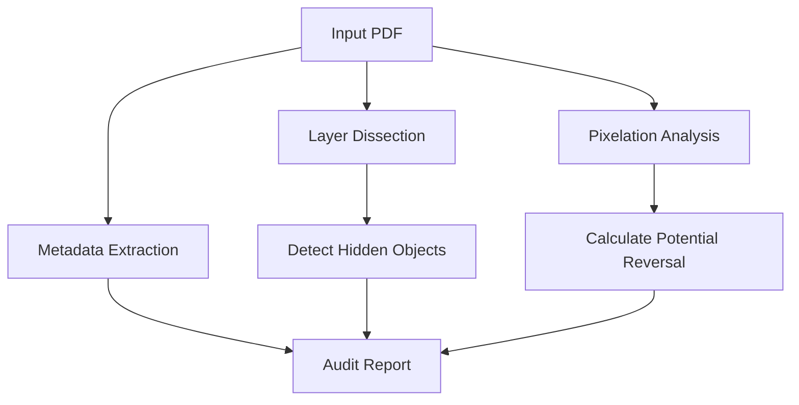

# 📄 Forensic Redact Breaker (PDF Security Auditor)

A specialized C++ forensic tool designed to audit and "break" improperly redacted PDF documents. **Redact Breaker** analyzes PDF structures to identify leaked metadata, hidden layers, and poorly implemented pixelation/blur blocks that can be reversed to reveal sensitive information.

## 🔍 Forensic Analysis Flow

The tool performs a multi-stage audit of the target PDF file to identify security vulnerabilities.

## 🛠️ Technical Features

- **Object Tree Inspection**: Deep traversal of the PDF object graph to find discarded but still present text elements.
- **Redaction Verification**: Validates if black boxes are actual vector objects or just visual overlays that can be moved.
- **Heuristic Reconstruction**: Uses statistical analysis to attempt reconstruction of redacted text based on font metrics and layout remains.
- **Batch Processing**: High-performance C++ engine capable of auditing thousands of documents per minute.

## 💻 Tech Stack
- **Language**: C++20
- **Libraries**: Poppler / PoDoFo (Internal forks for forensic access)
- **Formatting**: JSON/MD export for forensic reporting.

---
> [!IMPORTANT]
> This tool is part of the **Sentinel Data Solutions** suite for government and private security auditors.

**Sentinel Data Solutions** | *Precision PDF Forensics*
**Developed by Zeca**
